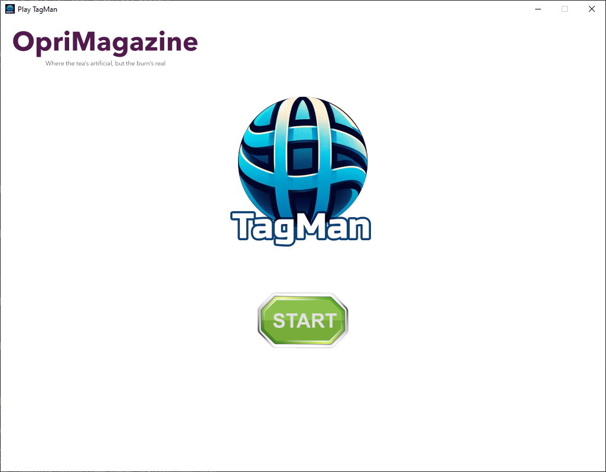
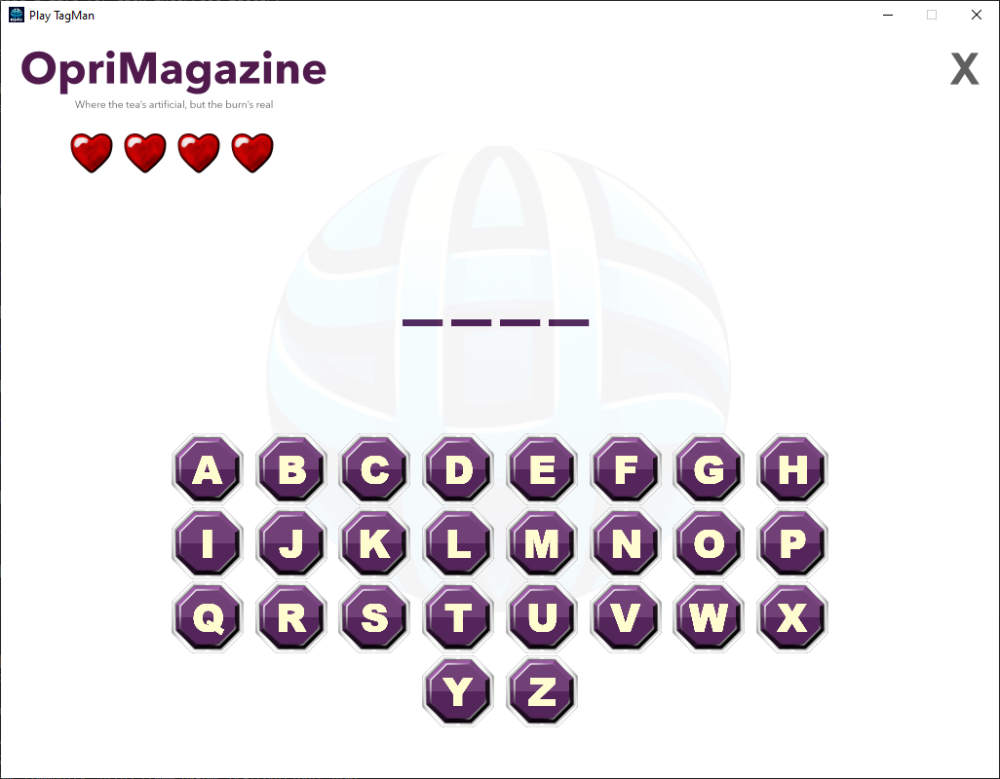
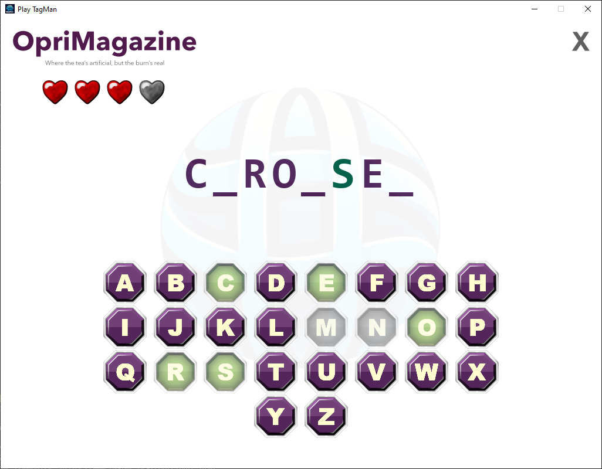
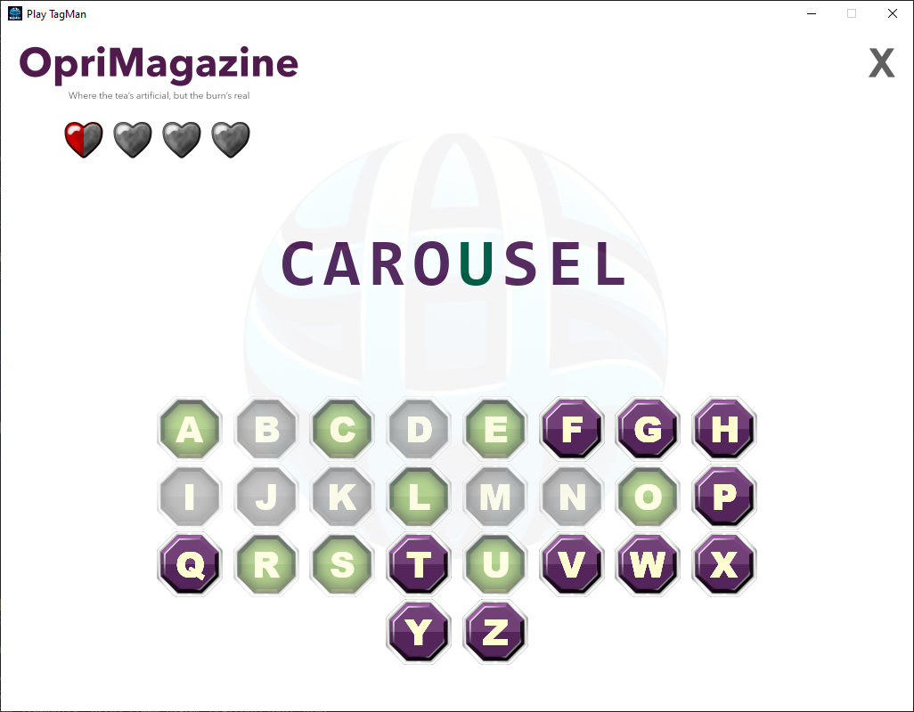
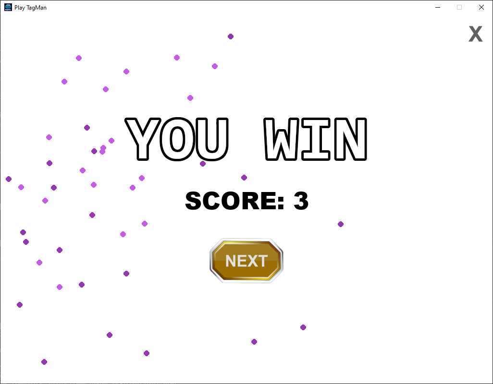
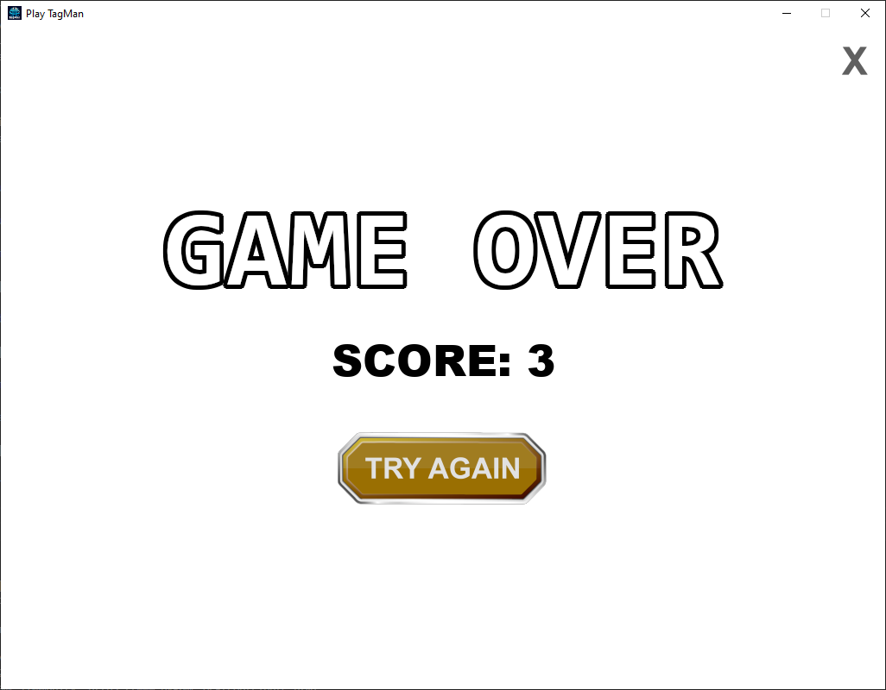

# What is TagMan?

**Welcome to TagMan!**

TagMan is a game of finding words by guessing one letter at a time. Each time you play you get a new word. Guessing correct letters fill the answer with the correct guesses and with wrong guesses you will lose lives.
If you run out of lives before finishing filling up the answer you will lose.

Embark on a simple, but fun, interactive word-finding adventure with TagMan! Are you ready to challenge your word skills in a game where every guess counts?

**Features:**

 - Start screen
 - Play screen
 - Score screen
 - Animations
 - Score tracker

**Gameplay:**

 - Guess the Word: Select one letter at a time to form words.
 - Heart System: Start with 4 hearts, each full heart equals 2 lives, and half a heart equals 1 life.
 - Lives: Lose a life for each incorrect letter.
 - Game Over: Out of hearts? No problem, start again with a new word and a fresh challenge!

**Controls:**

 - Play using Mouse, Touch Screen, or Keyboard.
 - Quick navigation with keyboard shortcuts: SPACEBAR/ENTER to select, ESCAPE to go back.

# Main Menu

# Play Menu

## New word

## Two wrong guesses, four correct guesses

## Finished word

# Score Menu

## Win Screen (includes fireworks animation)

## Lose Screen

